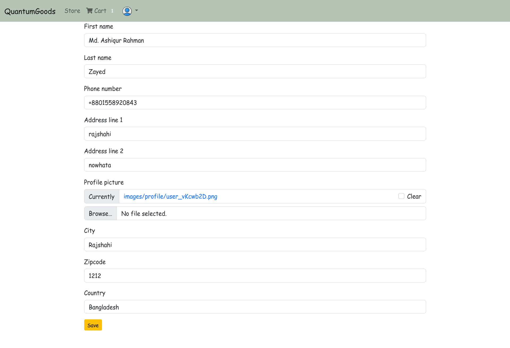

# QuantumGoods

## Setup
The first thing is cloning the repository:
```sh
$ git clone https://github.com/MdAshiqurRahmanZayed/QuantumGoods.git
$ cd QuantumGoods
```
Create a virtual environment to install dependencies in and activate it:
```sh
$ python -m venv env
$ source env/bin/activate
```
Then install the dependencies:
```sh
(env)$ pip install -r requirements.txt
```
Create info.py in the jobPortal folder just like info-demo.py and fill in the equivalent answer(sslcomrez storeid,and passcode).<br>
We have to migrate.
```sh
$ python manage.py makemigrations 
$ python manage.py migrate 
$ python manage.py createsuperuser
```

```sh
(env)$ python manage.py runserver
```
And navigate to `http://127.0.0.1:8000/`<br>
Demo screenshotss:




